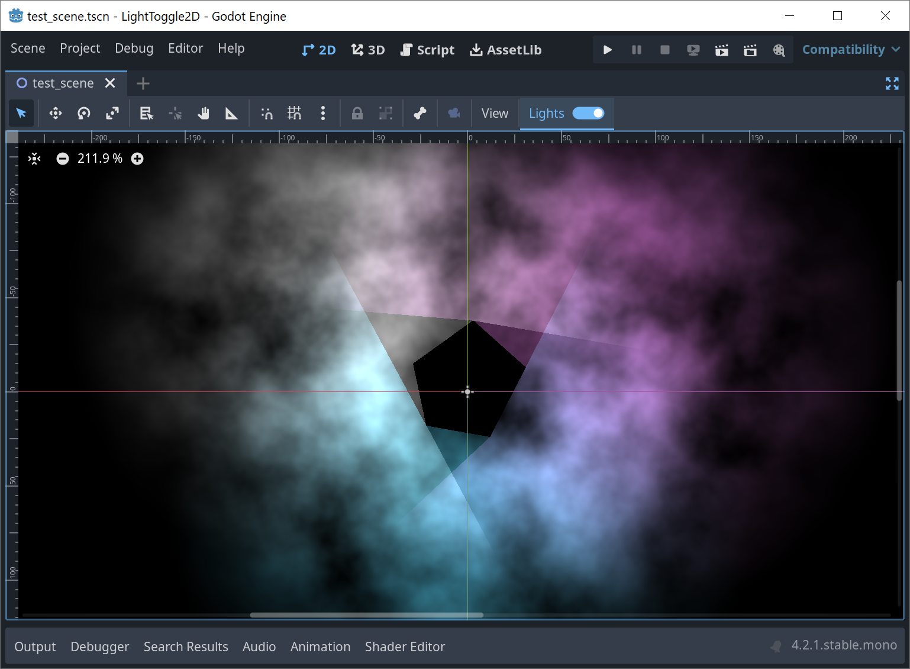
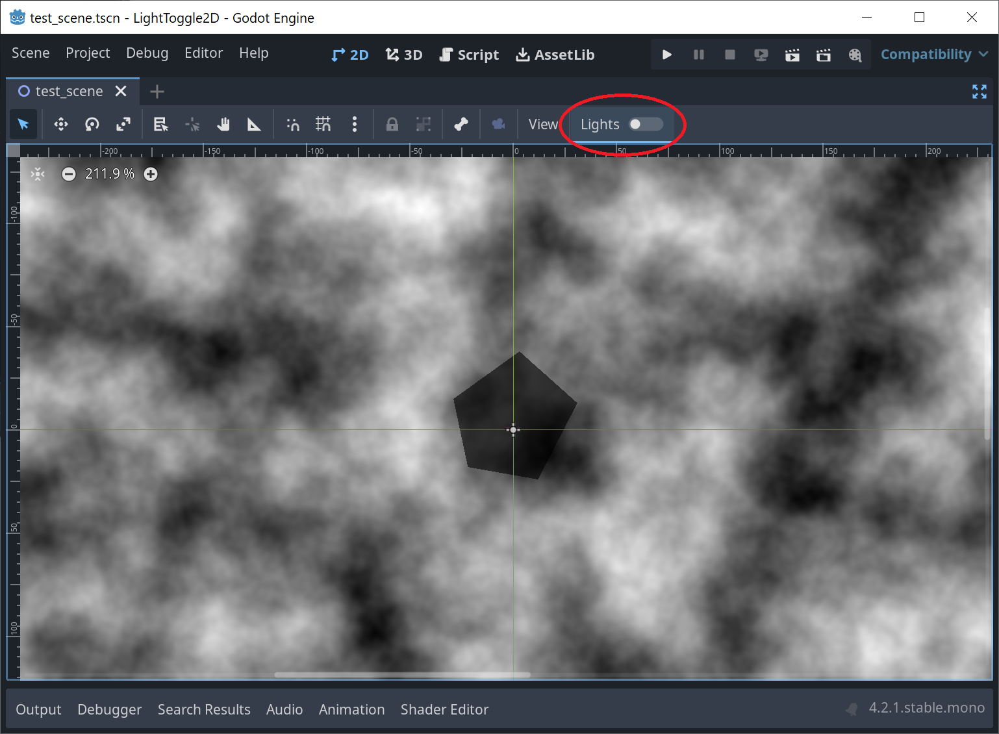

# Editor Light Toggle 2D
A Godot addon for disabling lighting in editor for 2D scenes. Useful for scenes where lighting makes it hard to see the big picture, for example dark levels. Compatible with Godot 4.0 or newer.

## Using LightToggle2D
* Install by downloading the project and copying `addons` folder into your project.
* Enable plugin in `Project` > `Project Settings...` > `Plugins` > `LightToggle2D`
* Use the `Lights` button in toolbar for 2D scenes.
 
Before:

After:

## Known limitations
* LightToggle2D works only on PointLight2D and DirectionalLight2D, CanvasModulate is not supported.
* Modifying lights when lights are toggled off can cause strange effects. This is harmless, and can be fixed by toggling lights on and off (besides, who adjusts light nodes when they are not visible? ^^).
* Plugin has not been tested thoroughly, use at your own risk (and make backups)!
